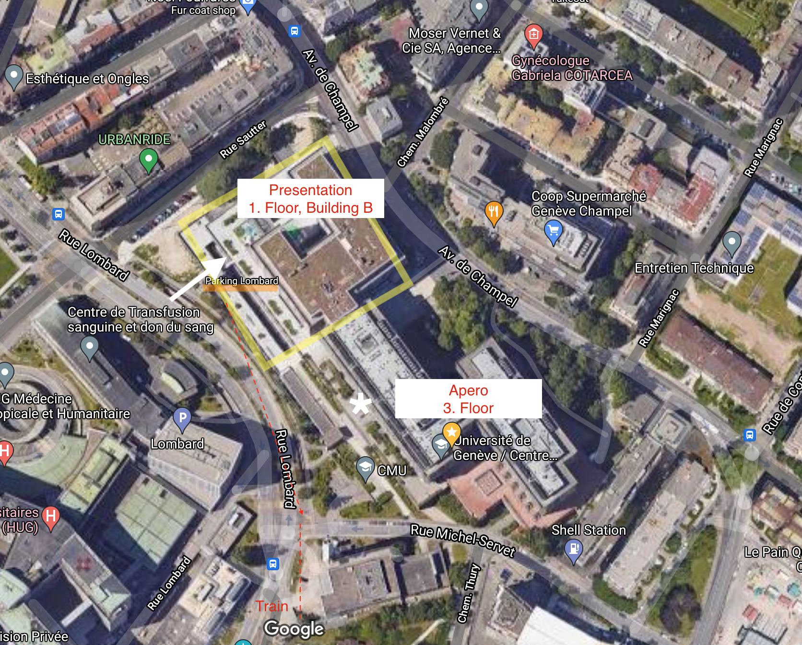

I will soon graduate and defend my PhD thesis entitled "Computational Approaches for a Healthier Microbiome".
I would love you to be part of this event in one way or another.

{}

Note, there are a public and a private defense. You can attend both.

{}

I make a public defence on **Friday 3. September**. This way, I will be able to present my work in a funny and accessible manner without the stress of failing to answer properly the questions of the jury.

## Plan:

| Time (CET) |                  |  Place                  |
| ---------- | ------------------------------------------------ | ----------------------- |
| 16:30      | I present my PhD work in an accessible  manner.  | L’auditoire Renold      |
| 17:00      | Apéro                                            | Outside, 3d floor       |

The public defence should be streamed with this [Zoom link](https://unige.zoom.us/j/61936446604). If you register I will send it to you by mail.

## Registration:
[Please register](https://docs.google.com/forms/d/e/1FAIpQLSeAHJ46OhK3DptDC83yRPnylbJBHPDx5Uu1zfSjIcvXjA_xSw/viewform), so that I can send you the information at the right time. Registration is mandatory for person attending in person.

People who already registered previously will be contacted individually, they don't need to register once more.

## Directions:

Address:
New building (yellow shade in map),\
Centre médical universitaire,\
Rue Michel-Servet 1,\
1206 Genève  

[Google Maps](https://www.google.com/maps/place/Section+Des+Sciences+Pharmaceutiques/@46.1944357,6.1496421,295m/data=!3m2!1e3!4b1!4m5!3m4!1s0x478c7b2cc9e0308b:0xcd4cb7bc26311978!8m2!3d46.1943481!4d6.1505779)

L'auditoire Renold: 1st floor (B01.2426). \
Apéro: 3d floor, on the side facing Rue Lombard.

## Official PhD examination
If you wish, it is still possible to join virtually or even in person the official defence that will be held on 31.8 at 10:30 - 11:00 (CET).
The presentation will be more adapted for an audience knowing the subject.

Please also register so I will send you the Zoom link for the PhD examination. 

## My Thesis

If you want to have a look at what I've written, please see below:


