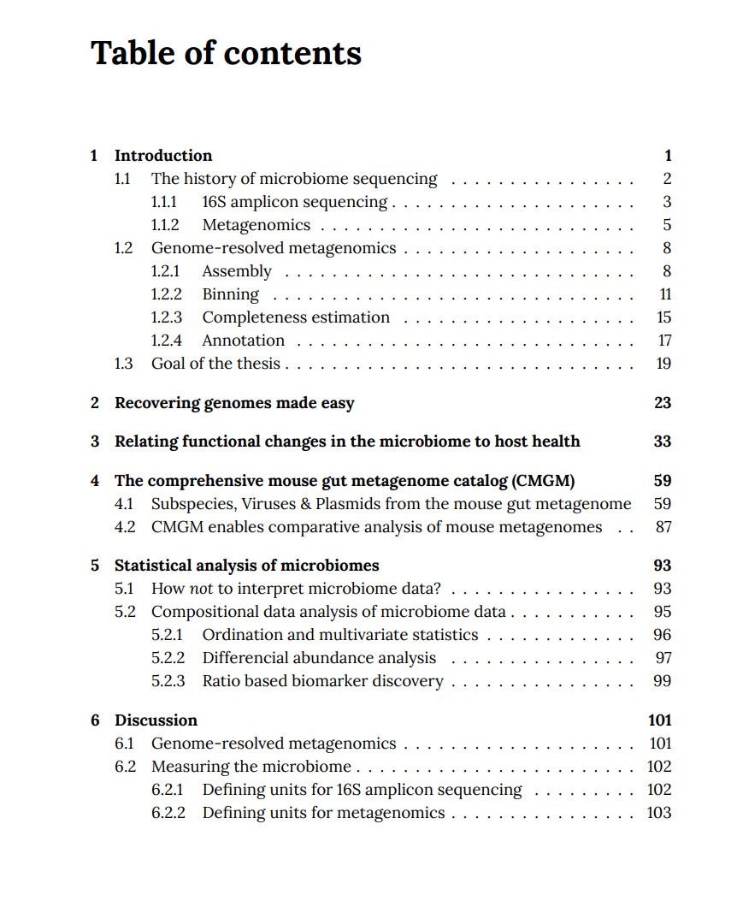
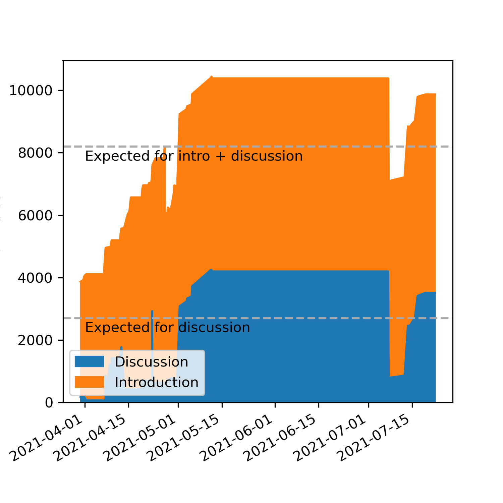

I finished writing my PhD Thesis with the title:

**Computational approaches for a healthier microbiome**

[Here is the PDF](Thesis_Kieser_V1_with_line_numbers.pdf)

If you have any comments please e-mail or write me. I'm happy to take them into account.

I made a small graphic how many words I wrote over time. The chapters consist mainly of the publications, therefore I didn't took them into account.

