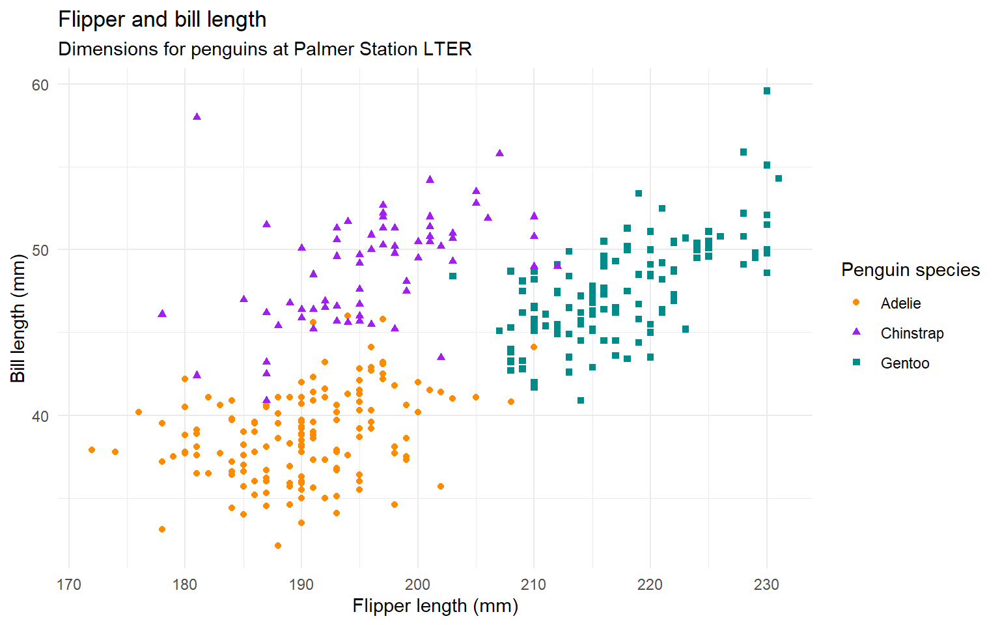
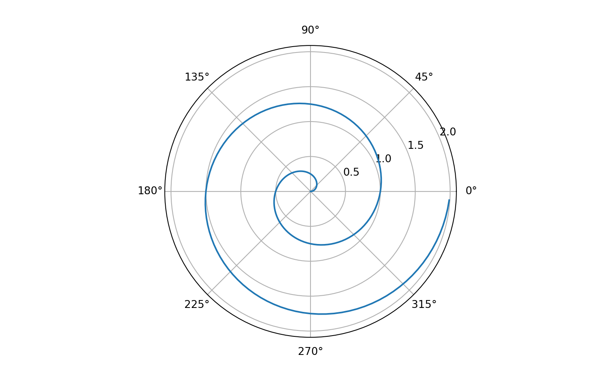

-   [Quarto Document](#quarto-document)
    -   [R code](#r-code)
    -   [Python](#python)

## Quarto Document

Quarto enables you to weave together content and executable code into a finished document. To learn more about Quarto see <https://quarto.org>.

Now I add a citation to a doi1

### R code

The `penguins` data from the [**palmerpenguins**](https://allisonhorst.github.io/palmerpenguins "palmerpenguins R package") package contains size measurements for 344 penguins from three species observed on three islands in the Palmer Archipelago, Antarctica.

The plot below shows the relationship between flipper and bill lengths of these penguins.

### Python

And now I use python in the same document see the [Figure 1](#fig-polar).

> **Note**
>
> I needed to install `nbclient` using pip to make it work.

1. McMurdie, P. J. & Holmes, S. [Phyloseq: An r package for reproducible interactive analysis and graphics of microbiome census data](https://doi.org/10.1371/journal.pone.0061217). *PLoS ONE* **8**, e61217 (2013).
